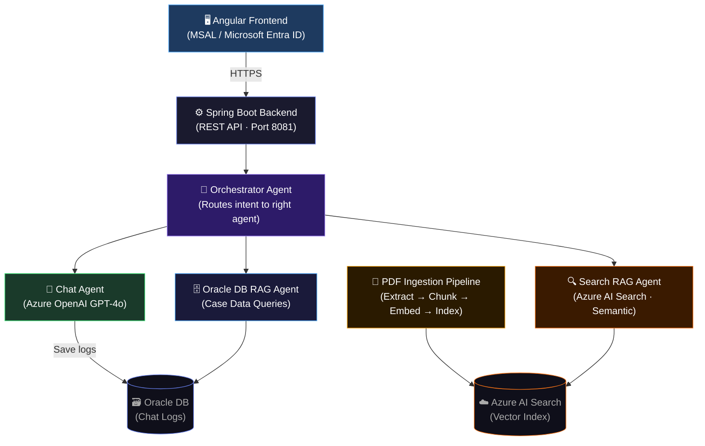

# ACS AI Chatbot — RAG Pipeline with Azure OpenAI GPT-4o

> Built during my internship at **NYC Administration for Children's Services (ACS)**, Office of Information Technology.  
> Presented at the ACS Summer Intern Showcase — certificate signed by the ACS Commissioner.

A production-grade AI assistant for NYC child welfare caseworkers, powered by a **Retrieval-Augmented Generation (RAG)** pipeline using Azure OpenAI GPT-4o and Azure AI Search.

---

## Architecture



## Tech Stack

| Layer | Technology |
|-------|-----------|
| AI / LLM | Azure OpenAI GPT-4o |
| Vector Search | Azure AI Search (semantic + vector) |
| Backend | Java 17, Spring Boot 3 |
| Frontend | Angular 17, TypeScript |
| Auth | Microsoft Entra ID (MSAL) |
| Database | Oracle DB (chat logs), Azure SQL |
| Embeddings | text-embedding-3-large |
| DevOps | Docker, Azure Container Apps, Azure Pipelines |

## Key Features

- **Multi-agent orchestration** — routes queries to the right agent (chat, document search, or database lookup)
- **RAG pipeline** — chunks, embeds, and indexes documents; retrieves relevant context before generating answers
- **Government-grade auth** — Microsoft Entra ID with MSAL for secure government network access
- **Chat log persistence** — full audit trail stored in Oracle DB for compliance
- **PDF ingestion** — automatically extracts, chunks, and indexes policy documents into Azure AI Search

## Project Structure

```
├── backend/                    # Spring Boot REST API
│   ├── src/main/java/
│   │   ├── agent/              # Orchestrator, Chat, SearchRAG, OracleDbRAG agents
│   │   ├── controller/         # ChatController, FeedbackController
│   │   ├── pdfqa/              # PDF ingestion, chunking, embedding, search
│   │   ├── service/            # ChatLogService
│   │   └── config/             # Azure OpenAI config, CORS
│   ├── Dockerfile
│   └── azure-pipelines.yml
│
└── frontend/                   # Angular 17 app
    └── src/app/
        ├── chat-bot/           # Main chat UI component
        ├── welcome-page/       # Landing page
        ├── msal.config.ts      # Azure AD authentication config
        └── services/           # API service layer
```

## Setup

### Prerequisites
- Java 17+
- Node.js 18+ / Angular CLI
- Azure OpenAI resource (GPT-4o deployment)
- Azure AI Search resource

### Backend

```bash
cd backend

# Set environment variables
export AZURE_OPENAI_ENDPOINT=your_endpoint
export AZURE_OPENAI_API_KEY=your_key
export AZURE_SEARCH_ENDPOINT=your_search_endpoint
export AZURE_SEARCH_API_KEY=your_search_key
export AZURE_SEARCH_INDEX=your_index_name
export AZURE_SQL_URL=your_sql_url
export AZURE_SQL_USERNAME=your_username
export AZURE_SQL_PASSWORD=your_password

mvn spring-boot:run
# API runs on http://localhost:8081
# Swagger UI: http://localhost:8081/swagger-ui.html
```

### Frontend

```bash
cd frontend
npm install

# Update src/app/msal.config.ts with your Azure AD credentials
# clientId: 'YOUR_AZURE_AD_CLIENT_ID'
# authority: 'https://login.microsoftonline.com/YOUR_AZURE_AD_TENANT_ID'

ng serve
# App runs on http://localhost:4200
```

### Docker (Backend)

```bash
cd backend
docker build -t acs-chatbot .
docker run -p 8081:8081 \
  -e AZURE_OPENAI_ENDPOINT=... \
  -e AZURE_OPENAI_API_KEY=... \
  acs-chatbot
```

## Environment Variables

| Variable | Description |
|----------|-------------|
| `AZURE_OPENAI_ENDPOINT` | Azure OpenAI resource endpoint |
| `AZURE_OPENAI_API_KEY` | Azure OpenAI API key |
| `AZURE_SEARCH_ENDPOINT` | Azure AI Search endpoint |
| `AZURE_SEARCH_API_KEY` | Azure AI Search admin key |
| `AZURE_SEARCH_INDEX` | Search index name |
| `AZURE_SEARCH_SEMANTIC_CONFIG` | Semantic configuration name |
| `AZURE_SQL_URL` | Azure SQL JDBC connection string |
| `AZURE_SQL_USERNAME` | Database username |
| `AZURE_SQL_PASSWORD` | Database password |
| `ACR_USERNAME` | Azure Container Registry username (CI/CD) |
| `ACR_PASSWORD` | Azure Container Registry password (CI/CD) |

## Author

**Naveen Kshirasagar** — Java Full Stack Developer Intern @ NYC ACS  
[Portfolio](https://frontend-livid-ten-44.vercel.app) · [GitHub](https://github.com/Naveen6960) · [LinkedIn](https://www.linkedin.com/in/naveen-kshirasagar-391657246/)
